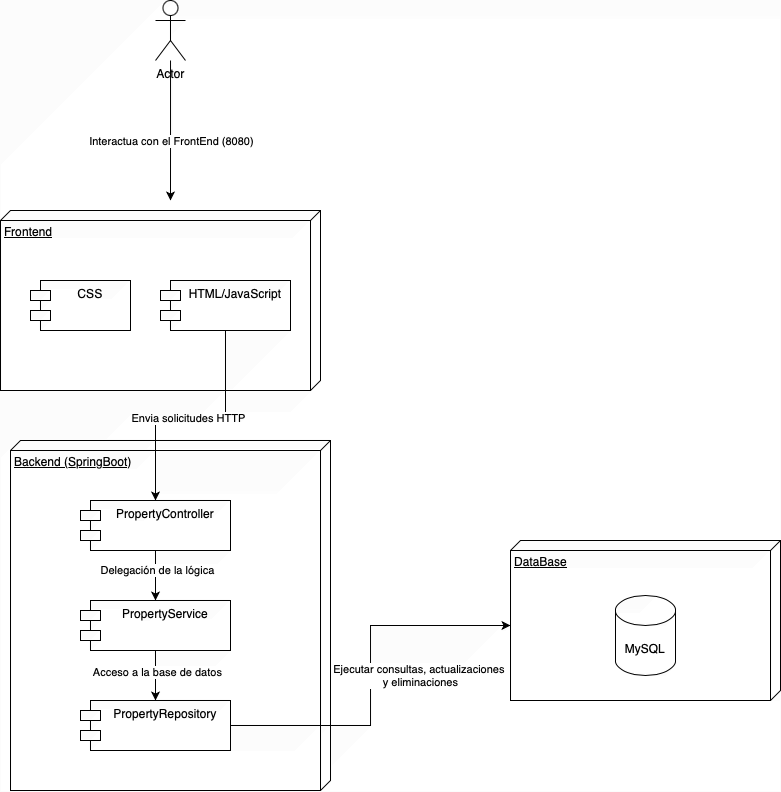
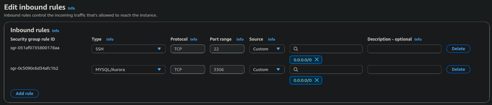

<div align="center">
<h1 align="center">Property Management System</h1>
<p align="center">
A comprehensive property management system built with Spring Boot, providing full CRUD operations for property inventory management with a modern web interface.
</p>
</div>

<br>

## Project Summary

This system is designed to manage property inventory through a web-based interface. The application provides complete Create, Read, Update, and Delete (CRUD) operations for property management, including features such as:

- **Property Management**: Add, view, update, and delete property listings
- **Advanced Search**: Filter properties by name, address, price range, and size
- **Pagination**: Efficient handling of large property datasets
- **RESTful API**: Complete REST API for property operations
- **Web Interface**: User-friendly HTML interface for property management
- **Data Persistence**: MySQL database integration with JPA/Hibernate

### Video

https://github.com/user-attachments/assets/5cf440e3-efe3-48b8-91fe-36b2654d9577

<br>

## System Architecture

1. **Frontend** sends HTTP requests to REST endpoints
2. **Controller** receives requests and delegates to service layer
3. **Service** implements business logic and validation
4. **Repository** handles database operations using JPA
5. **Database** persists and retrieves property data




### Core Classes

#### Inventory Entity

```java
@Entity
@Table(name = "inventory")
public class Inventory {
    @Id
    @GeneratedValue(strategy = GenerationType.IDENTITY)
    private Long id;
    private String name;
    private String address;
    private Integer price;
    private Integer size;
    private String description;
}
```

#### InventoryController

- **Purpose**: Handles HTTP requests and responses
- **Endpoints**:
  - `POST /api/inventory` - Create new property
  - `GET /api/inventory` - Get all properties with pagination and filtering
  - `GET /api/inventory/{id}` - Get specific property
  - `PUT /api/inventory/{id}` - Update property
  - `DELETE /api/inventory/{id}` - Delete property

#### InventoryService
- **Purpose**: Implements business logic and validation
- **Key Methods**:
  - `createInventory()` - Property creation logic
  - `findAll()` - Retrieve with filtering and pagination
  - `findById()` - Single property retrieval
  - `updateInventory()` - Update existing property
  - `deleteInventory()` - Property deletion

#### InventoryRepository
- **Purpose**: Data access layer using Spring Data JPA
- **Features**:
  - Automatic CRUD operations
  - Custom query methods
  - Specification-based dynamic queries

### Data Transfer Objects (DTOs)

- **InventoryCreateRequest**: For property creation
- **InventoryUpdateRequest**: For property updates
- **InventoryResponse**: For API responses
- **InventorySearchParams**: For search and filtering parameters

<br>

## Deployment Instructions

- Clone the Repository

```bash
git clone https://github.com/Andr3xDev/TDSE-jpa-crud
cd TDSE-jpa-crud
```

- Build and Run with Docker Compose

```bash
docker-compose up --build
```

- Access the Application
  - **Web Interface**: http://localhost:8080
  - **API Documentation**: http://localhost:8080/api/inventory


### AWS Deployment

#### 1. Build Docker Image
```bash
docker build -t property-management .
docker tag property-management <your-account-id>:latest
```


#### 2. Push to AWS ECR
```bash
docker push <your-account-id>/property-management:latest
```


#### 3. Deploy using AWS ECS or EC2
- Create an ECS service using the pushed image
- Configure environment variables for database connection
- Set up Application Load Balancer for public access
- Configure security groups to allow traffic on port 8080




### Environment Variables for Production
```bash
SPRING_DATASOURCE_URL=jdbc:mysql://your-rds-endpoint:3306/properties
SPRING_DATASOURCE_USERNAME=your_db_username
SPRING_DATASOURCE_PASSWORD=your_db_password
SPRING_JPA_HIBERNATE_DDL_AUTO=update
SERVER_PORT=8080
```

## 📸 Screenshots

### Main Dashboard
The main interface shows the property management dashboard with forms for creating new properties and a searchable list of existing properties.


